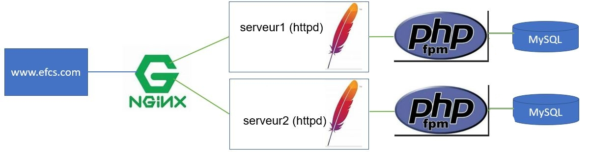

# Évaluation finale à caractère synthèse 
## Partie pratique (TP3)

### Informations

- Évaluation : 20 % pour la partie pratique.
- Type de travail : individuel.
- Date de remise : voir sur léa.
- Durée : 9 heures, dont 3 séances. 
- Système d’exploitation : Linux / Docker
- Environnement : virtuel / Docker.

### Objectifs

- Appliquer des procédures d’Installation des services Internet conformément aux procédures et spécifications techniques.  
- Configurer des services Internet selon la documentation ou le plan de conception (Ex. : architecture réseau, technologique, etc.).  
- Tester adéquatement le fonctionnement des services Internet.  
- Activer des services Internet selon les procédures recommandées.  
- Appliquer des correctifs et des mises à jour sur les systèmes d’exploitation serveur.  


### Description

Cette épreuve à caractère synthèse à deux sections.  

La première section sera un travail pratique où vous aurez les tâches suivantes à accomplir:  

- Faire une installation complète d’un site Web avec équilibrage de charge.  
- Utiliser Nginx comme un équilibreur/répartiteur de charge (load balancer).  
- Utiliser Apache (httpd) comme serveur de contenus.  
- Utiliser php-fpm comme fastCgi.  
- Utiliser MySQL comme serveur de base de données.  
- Le tout automatisé avec Ansible et avec l'utilisation de conteneur.  

La deuxième section sera un questionnaire récapitulatif du cours et aura lieu le 10 octobre 12h30.

## Partie 1 : Déploiement d'un environnement avec Ansible

### Description de l'infrastructure

Vous allez utiliser Nginx comme équilibreur de charge pour avoir une structure comme celle-ci :




Donc, on se connecte sur <code>www.efcs.com</code> qui appelle le proxy nginx qui lui appelle en alternance les serveurs 1 et 2. Chacun des serveurs est relié à un serveur php et à un serveur MySQL.  

- Vous aurez trois VMs serveurs : une pour l'équilibreur de charge et deux pour les serveurs Web (n'oubliez pas de renommer vos VMs, de créer les utilisateurs...)  
	- Utiliser le gabarit DFC DS -> VM DFC -> Modeles -> ClaudeRoy -> TPL\_20231002\_UbSrv2204_BaseSmall.  
	- Utilisez les noms de VMs : `srv-lb1-[matricule]`, `srv-web1-[matricule]`, `srv-web2-[matricule]`.
- Les services seront des conteneurs.  
- Les deux serveurs Web doivent être identiques, à part une information, dans la page Web, qui permet de distinguer le serveur 1 et le serveur 2 : par exemple le hostname ou/et l'adresse IP.  
- Les serveurs httpd seront reliés à un réseau avant pour la communication extérieur.  
- Les serveurs httpd auront chacun leur réseau arrière pour communiquer avec leurs serveurs php et MySQL.  
- Le fichier de configuration de httpd.conf doit être monté par un point de montage au fichier httpd.conf du conteneur.
- Le contenu des serveurs httpd doit être monté par un point de montage à un répertoire de la VM.  
- Le serveur MySQL doit avoir un volume de données persistant dans la VM.  
- Vous devrez démontrer le système fonctionnel.  

**Attention :** ne mettez pas de dépendance aux serveurs httpd.

### Ansible 

#### Spécifications pour les noeuds gérés :

- Un fichier d'inventaire en format YAML doit contenir :  
	- Tous les hôtes via le groupe "all" et ils devront avoir pour login <code>admin</code>.
	- Ne pas inclure le noeud de contrôle dans l'inventaire.  
	- Vous devez avoir un groupe _lbservers_ pour l'équilibreur de charge et un groupe _webservers_ pour les serveurs Web.
	- Les noeuds gérés devront également faire partie d'un groupe appeler _prod_ (consulter la documentation sur le principe parent-enfant).  
- Le mot de passe à utiliser pour toutes les connexions ssh devra être ***CegepSt&Foy*** pour toutes les machines du groupe _prod_.  
- Les mots de passe doivent être placés dans un fichier chiffrer par Ansible Vault. Le mot de passe pour l'Ansible Vault est <code>secret</code>.  
- La variable _env_ devra être égale à _production_ pour toutes les machines du group _prod_. La variable doit être placée dans une variable de groupe.  

#### Vous devez avoir des playbook pour :

- LoadBalancer
- Web : gère également php et MySQL

#### Votre déploiement :

- Se fait avec une seule commande et reproduit toute l'architecture : vous allez avoir un playbook nommé <code>deploiement.yaml</code>.


## Remise 

Vous devez fournir (déposé sur LÉA) :

- L'adresse de votre dépôt GitHub dans un fichier texte (non compressé).

Vous devez fournir (déposé sur GitHub) :

  - Un dépôt privé avec votre code source de l'EFCS.
      - Un fichier README.md qui résume les informations sur le dépôt.
    	- Nom du projet  
       - Date 
       - Description du projet  
      - Le dépôt doit inclure le fichier .traces\_d\_ansible. 
  - Tous les fichiers de votre travail à l'exception de la vidéo.  
  - Je dois trouver l'adresse (en hyperlien) de votre vidéo dans le fichier readme.md de votre projet.  
  - Vous devez m'ajouter à votre dépôt comme collaborateur (jpduchesneauCegep).
  - Vous devez utiliser le format Markdown (md).
  - Vous devez donner vos sites de références.
  - L'utilisation des commits git est fondamentales dans ce type de travail. 
Nous devrions facilement retrouvé l'historique de votre travail en faisant afficher git logs.

Votre vidéo :  

- Une vidéo d'environ 8 min. (maximum 10 min.):  
	- Explication de tous vos fichiers  
	- Démonstration que le site fonctionne avec les deux serveurs

## Évaluation :

### Section 1 : /15  

|Item ||Points  | Résultat|
|--- | --- | :---: | :---:|
|LoadBalancer |||
||Définition des 2 serveurs|6||
||Contexte serveur|6||
|Serveur1/Serveur2 |||
||httpd|6||
||php|6||
||Lien entre php et MySQL |6||
||Page Web d'identification |5||
|Commandes ||||
||Ansible|40||
||Voir les traces (fichier .traces\_d\_ansible) d'ansible |10||
||Présence des commits |5||
|Compréhension|10||
|**Total** |**100**||


## Informations supplémentaires :

Pour créer un playbook qui regroupe tous les playbook, vous utilisez le module <code>import_playbook</code>.

```yaml
---
- name: Configure LoadBalancer
  ansible.builtin.import_playbook: loadBalancer.yaml
- name: Configure les serveurs Web
  ansible.builtin.import_playbook: Web.yaml

```

Vous pouvez utiliser le module <code>copy</code> dans un playbook :

```yaml
  tasks:
    - name: Telecharger Application
      copy:
        src: ./index.php
        dest: /home/admin/html/index.php
        mode: 0755

```

Pour organiser vos fichiers, vous pouvez créer des répertoires avec le module <code>file</code> :

```yaml
  tasks:
    - name: Creates directory
      ansible.builtin.file:
        path: /home/admin/html
        state: directory
        owner: admin
        group: admin
        mode: 0775
```

## Références :

[A system administrator's guide to getting started with Ansible - FAST!](https://www.redhat.com/en/blog/system-administrators-guide-getting-started-ansible-fast)  
[Documentation ansible pour fichier inventaire avec des relations parent/enfant](https://docs.ansible.com/ansible/latest/inventory_guide/intro_inventory.html#grouping-groups-parent-child-group-relationships)  
[Documentation ansible pour group_vars](https://docs.ansible.com/ansible/latest/inventory_guide/intro_inventory.html#organizing-host-and-group-variables)  
[Documentation ansible pour import_playbook](https://docs.ansible.com/ansible/latest/collections/ansible/builtin/import_playbook_module.html)  
[Documentation ansible pour copy](https://docs.ansible.com/ansible/latest/collections/ansible/builtin/copy_module.html)  
[Documentation ansible pour file](https://docs.ansible.com/ansible/latest/collections/ansible/builtin/file_module.html#file-module)  
[Documentation de Community.Docker](https://docs.ansible.com/ansible/latest/collections/community/docker/index.html#description)  
[Documentation pour une adresse statique sur un serveur Ubuntu 22.04](https://www.linuxtechi.com/static-ip-address-on-ubuntu-server/)  
[Documentation pour l'utilisation de la fonction php_uname](https://www.php.net/manual/en/function.php-uname.php)
